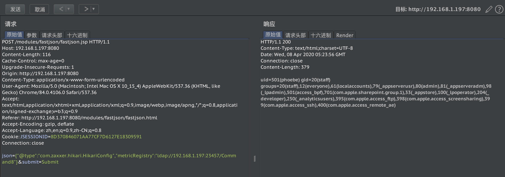
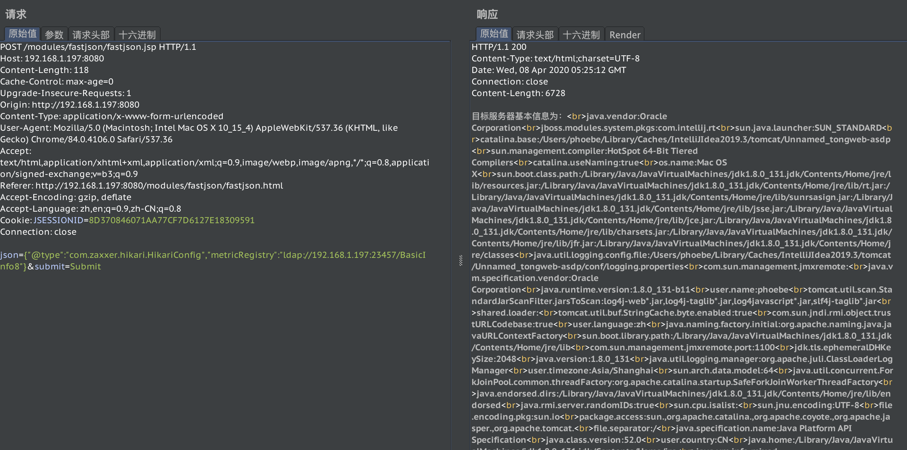
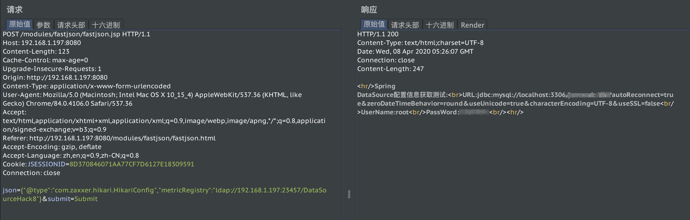
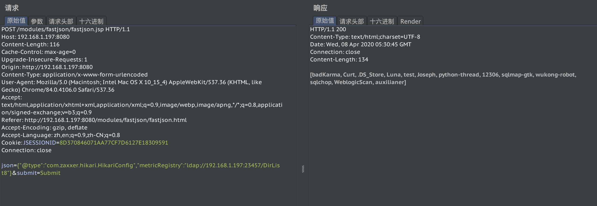
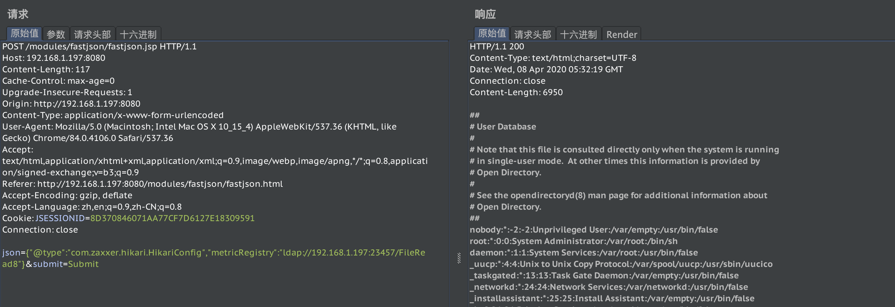
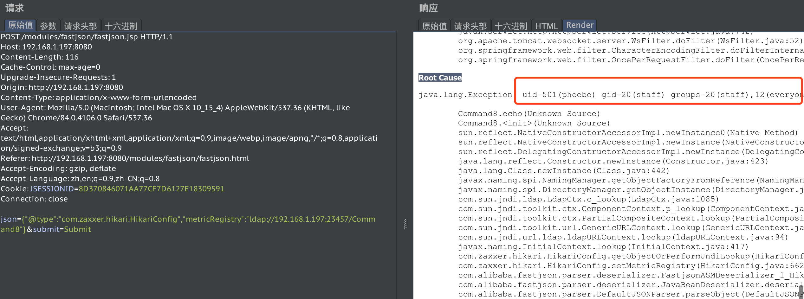
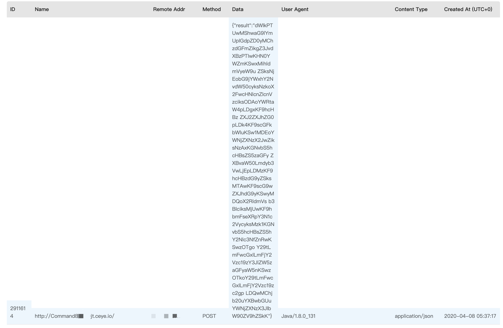

# JNDI 注入利用工具


# 介绍
本项目为 JNDI 注入利用工具，生成 JNDI 连接并启动后端相关服务，可用于 Fastjson、Jackson 等相关漏洞的验证。

本项目是基于 welk1n 的 [JNDI-Injection-Exploit](https://github.com/welk1n/JNDI-Injection-Exploit/)，在此项目的基础服务框架上，重新编写了攻击利用代码，支持<font color="red">更多更强大</font>的功能，并加入了<font color="red">多种方式进行回显</font>的支持。

本项目为学习性项目，目前本人 Java 水平依然处于 hello world 的水平，建议各位师傅报着批判的眼光观看，不吝指导。QAQ


# 功能

本工具支持了利用 JNDI 注入构造多种恶意 payload，其中包括：

| 名称           | 功能                       | 简介                                   |
| -------------- | -------------------------- | -------------------------------------- |
| BasicInfo      | 获取服务器基础信息         | 打印出 System.getProperties() 中的信息 |
| Command        | 命令执行                   | 反射调用 forkandexec 执行命令          |
| DataSourceHack | 获取Spring DataSource 明文 | 获取缓存在上下文中的 DataSource        |
| DirList        | 目录遍历                   | 使用 File 对象列目录                   |
| FileDelete     | 文件删除                   | 使用 File 对象删除文件                 |
| FileRead       | 文件读取                   | 使用 FileInputStream 读取文件          |
| FileWrite      | 文件写入                   | 使用 FileOutputStream 写文件           |
| SQL Query      | 执行SQL语句                | 使用 JDBC 发出查询                     |
| SSRF           | 访问内网应用               | 发送 HTTP 请求，并将结果返回           |

对于具体功能的构建比较简单，几乎就是正常的功能性编程，只不过部分功能使用了反射，可能不易于阅读。

对这部分功能实现有疑问的同学可以在 [Javasec](http://javasec.org) 上找到相关的文章。

对于各项参数的配置使用了配置文件的方式，由于是在调用时会读取文件，并未将值进行缓存，所以可以随时修改配置文件中 payload 的值，无需重启服务。

除去基本功能，本工具加入了多种回显方式，使 JNDI 注入的结果能够返回，这样在研究或测试中可以更方便的看到结果，本攻击支持了如下回显方式：

| 名称          | 功能          | 简介                                     |
| ------------- | ------------- | ---------------------------------------- |
| ExceptionEcho | 报错回显      | throw 一个异常，message 是我们执行的结果 |
| OOBEcho       | 带外回显      | 向 dnslog 平台发送数据包携带执行结果     |
| TomcatEcho    | Tomcat 回显   | 通过 Tomcat 获取 response 将结果写入     |
| WebLogicEcho  | WebLogic 回显 | 通过 WebLogic 获取 response 将结果写入   |

有了这些功能，我们就可以把 JNDI 注入活活玩成 webshell。


# 使用

## 使用源代码执行：

下载项目源代码：

```shell
git clone git@github.com:JosephTribbianni/JNDI.git
```

执行 `org.su18.server.ServerStart` 的 `main()` 方法，可以在控制台中看到启动消息。

## 使用 jar 文件执行：

在 release 下载打包好的文件，解压压缩包，确保配置文件与 jar 文件位于同一目录下，请根据自定义需求修改端口号及其他配置项，运行 jar 文件：

```shell
java -jar JNDI-1.0-all.jar
```


## 查看生成的恶意类

可以使用 `org.su18.asm.frame.Frame` 类的 `main()` 方法生成 `.class` 文件进行查看。

执行后，会在项目根目录生成文件，使用任意手段 decompile 后可查看逻辑。


# 使用展示

这里利用 fastjson 结合 jndi 来进行部分功能使用展示：

命令执行 id ：



基础信息：



获取 Spring 数据源信息：



对我电脑上的 /Users/phoebe/PycharmProjects 进行目录遍历：



文件读取 /etc/passwd



等等，剩余的就不展示了，自测吧。

上面使用了 TomcatEcho 进行回显，其他回显展示：

报错回显：



OOB 回显：




# 技术细节

## 服务端

服务器端完全基于原项目，未进行大改动，将服务监听端口加入了配置文件中，方便修改。

## payload 细节

由于原项目仅执行了命令执行，并且是使用 `Runtime.getRuntime.exec()` 这种非常表面的接口调用，功能较为单一，且容易被防护阻断，因此这里我增加了多个功能模块，并对于多数模块，直接使用反射调用 native 方法执行功能，这可以在某种情况下完全绕过流量层或应用层的安全防护。对于其他功能则是正常的逻辑代码调用，基本不会触发任何规则。

## 回显细节

回显主要分为几类：

- 报错回显：直接抛出异常，这种方式能否回显完全取决于服务端对异常的处理情况。
- OOB回显：这里使用了 ceye.io，由于这个域名可能会被各大安全防护产品拉入黑名单，所以可以寻找小众的 dnslog 平台或自行搭建。
- response 回显：这里支持了 Tomcat 和 Weblogic 的回显，获取当前访问的 response 对象，并写回结果。

## 字节码拼接

在恶意类的字节码生成上，原项目使用编译好的 jdk7、jdk8 的 class 文件，使用 asm 加载并加入执行命令代码；本项目则直接使用 asm 完全生成类字节码。由于要实现模块化，这里设计了一个简单的代码结构：

```java
public class Template {

	private String result;

	public Template() throw Exception{
    // insert payload here
		this.echo();
	}

	public void echo() throw Exception{
    // how would you like to echo the result 
	}
}
```

由于 JNDI 注入的特性是会执行类的构造方法或 static 语句块，因此将恶意 payload 织入构造方法中，在执行完 payload 后，构造出响应的返回结果，放在 `this.result` 中，在构造方法的最后一行执行 `this.echo()` 方法，进行回显的逻辑。


# 未完成

1. 由于时间有限，ASM 生成的代码十分简陋，后期会改为使用 AdviceAdapter 的 onMethodEnter、onMethodExit更优雅的生成代码。
2. 由于 JNDI 注入本身需要出网，所以一些漏洞利用方式和回显方式显得有些鸡肋，后期会继续优化，添加新功能。
3. 仅使用了 jdk 1.8 进行测试，部分利用代码“可能”使用了 1.8 之后的新特性，在低版本上可能失效。
4. 加入 linux 文件描述符回显：本来想加的，根据几位师傅给出的思路经过了一下午的调试，还是没有做到通用有效的寻找文件描述符 id 的方法，后续有时间再弄吧。


# 参考文章

https://github.com/welk1n/JNDI-Injection-Exploit/

https://www.cnblogs.com/Welk1n/p/11446519.html

http://anquanke.com/post/id/200892

https://xz.aliyun.com/t/7348

http://javasec.org

http://p2j.cn


# 交流

Java 安全技术交流微信群：[javasec](http://javasec.org)，请前往网站添加管理员微信邀请您入群。

Javasec 项目是由 [安百科技](http://www.anbai.com/)-凌天实验室 发起，是一个免费、开源的 Java Web 安全相关知识归纳总结、培训的项目，相关问题可以在交流群内提出讨论或 Github 上提出 issues。

